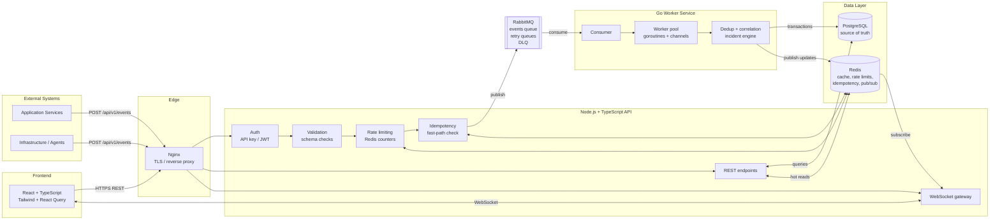
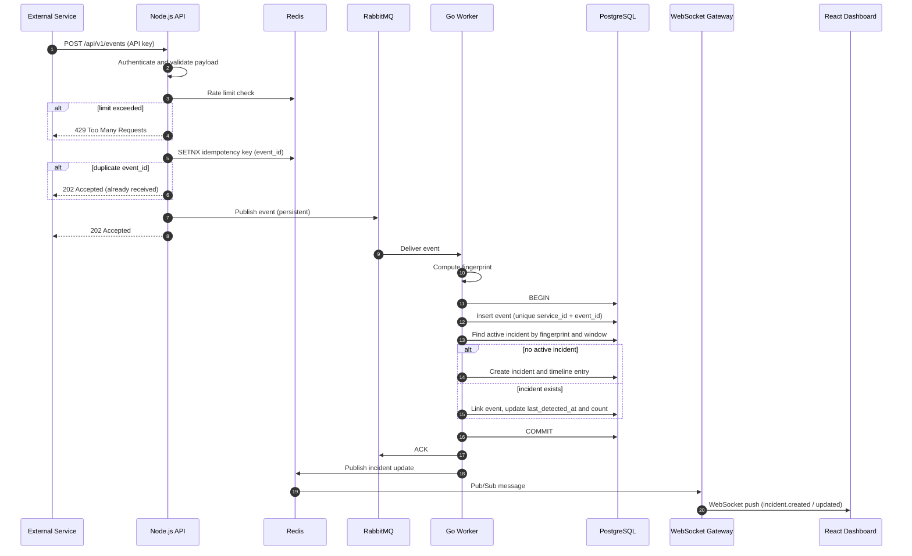
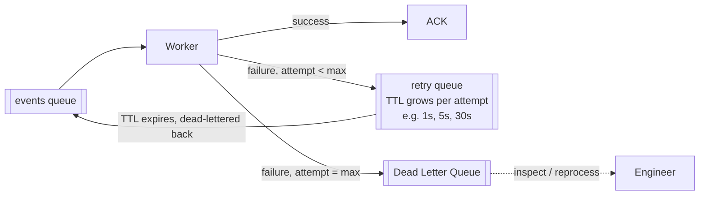
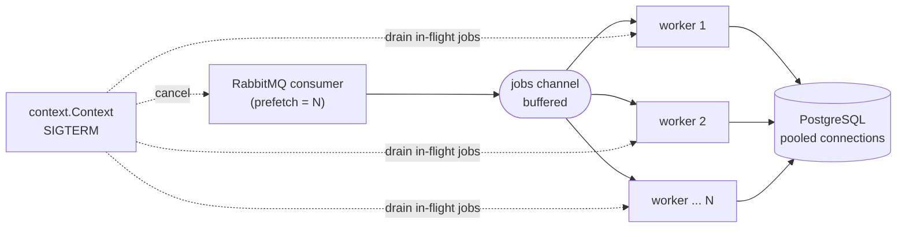
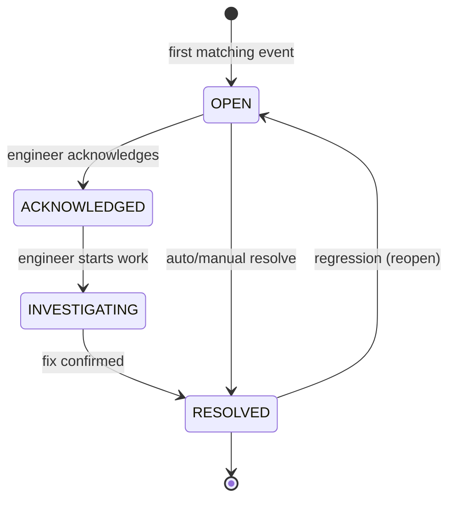
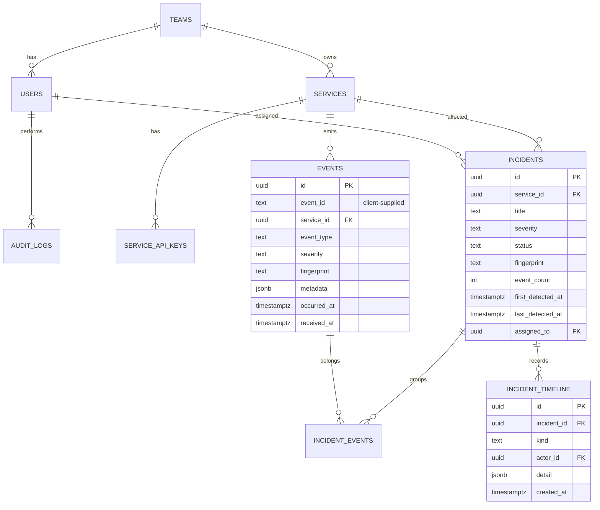

# SentinelOps

**Real-time incident intelligence and service reliability platform.**

SentinelOps ingests high-volume events from applications and infrastructure, deduplicates and correlates them into incidents, and gives engineering teams a live dashboard to investigate and resolve failures.

> **10,000 identical `payment-service` failures should produce 1 incident with 10,000 related events, not 10,000 alerts.**


---

## Table of Contents

1. [Project Status](#project-status)
2. [Why SentinelOps](#why-sentinelops)
3. [High-Level Architecture](#high-level-architecture)
4. [Event Lifecycle](#event-lifecycle)
5. [Core Concepts](#core-concepts)
6. [Tech Stack and Rationale](#tech-stack-and-rationale)
7. [Repository Structure](#repository-structure)
8. [Getting Started](#getting-started)
9. [API Overview](#api-overview)
10. [Data Model](#data-model)
11. [Security](#security)
12. [Observability](#observability)
13. [Scaling and Failure Modes](#scaling-and-failure-modes)
14. [Roadmap](#roadmap)
15. [Engineering Principles](#engineering-principles)
16. [Contributing](#contributing)
17. [License](#license)

---

## Project Status

SentinelOps is under active, incremental development. This README describes the **target design**. Features are marked honestly:

| Status | Meaning |
|--------|---------|
| ✅ Done | Implemented and tested |
| 🚧 In progress | Being built |
| 📋 Planned | Designed, not yet built |

See the [Roadmap](#roadmap) for the per-phase status. Nothing in this repository should be read as a production-readiness or performance claim until it is backed by tests and benchmarks that live in the repo.

---

## Why SentinelOps

During an outage, monitoring systems can generate thousands of near-identical alerts. Engineers drown in noise instead of fixing the problem. SentinelOps addresses this by:

- **Decoupling ingestion from processing**: the API accepts events fast and hands off heavy work to a queue.
- **Correlating events**: identical failures collapse into a single incident using a fingerprint and time window.
- **Being safe under retries**: duplicate deliveries are treated as one logical event.
- **Failing gracefully**: bounded retries with exponential backoff, then a Dead Letter Queue.
- **Updating live**: engineers see new incidents and state changes over WebSockets, with no refresh.

---

## High-Level Architecture



### Component responsibilities

| Component | Responsibility | Deliberately does NOT do |
|-----------|----------------|--------------------------|
| **Node.js API** | Authenticate, validate, rate limit, enqueue events; serve dashboard REST APIs; push real-time updates | Heavy event processing |
| **RabbitMQ** | Durable buffer between ingestion and processing; retry and dead-letter routing | Business logic |
| **Go workers** | Concurrent event processing, fingerprinting, deduplication, incident create/attach | Serve user-facing HTTP |
| **PostgreSQL** | Source of truth for events, incidents, users, audit logs | Low-latency counters |
| **Redis** | Rate limiting, short-lived idempotency keys, hot caches, pub/sub fan-out to WebSocket nodes | Durable storage |
| **React dashboard** | Overview, incident list/detail, service health, live updates | Any business logic |

---

## Event Lifecycle

The full path of a single event from arrival to dashboard update:



**Key point:** the API returns `202 Accepted` as soon as the event is durably queued. Processing is asynchronous, so ingestion latency stays low and is independent of database load.

---

## Core Concepts

### 1. Deduplication and correlation

Each event is reduced to a **fingerprint**:

```
fingerprint = hash(service + event_type + normalized_error_signature)
```

The worker looks up an **active incident** (not `RESOLVED`) with the same fingerprint inside a configurable **time window**. If found, the event is attached; otherwise, a new incident is created.

- **Severity escalation:** if an attached event has higher severity, the incident severity is raised and a `severity_changed` event is emitted.
- **Race safety:** two workers may process the same fingerprint simultaneously. A partial unique index on `(fingerprint) WHERE status <> 'RESOLVED'`, combined with `INSERT ... ON CONFLICT`, guarantees only one incident is created.
- **Normalization:** volatile values (IDs, timestamps, memory addresses) are stripped from error messages so equivalent failures produce the same signature.

### 2. Idempotency (two layers)

| Layer | Mechanism | Purpose |
|-------|-----------|---------|
| Fast path | Redis `SET NX` with TTL on `event_id` | Reject obvious duplicates before they hit the queue |
| Source of truth | PostgreSQL unique constraint on `(service_id, event_id)` | Correctness even if Redis is empty, evicted, or down |

Redis is an optimization; PostgreSQL is the guarantee. If `abc123` arrives three times, exactly one logical event is stored.

### 3. Retries, exponential backoff and Dead Letter Queue



- Attempt count is tracked in message headers.
- Retries are bounded, so there are no infinite loops.
- Poison messages land in the DLQ with the failure reason attached, and can be inspected and replayed.
- Workers only ACK after the database transaction commits (at-least-once delivery, made safe by idempotency).

### 4. Go worker pool



- A fixed number of goroutines pull from a buffered channel; the buffer size and RabbitMQ prefetch provide **backpressure**.
- **Graceful shutdown:** on `SIGTERM`, the consumer stops accepting messages, in-flight jobs finish (bounded by a timeout), and unacked messages are redelivered.
- Every DB call uses a `context` with a timeout.

### 5. Incident lifecycle



Every transition writes an `incident_timeline` row and an `audit_logs` entry.

### 6. Rate limiting

Per-API-key and per-IP counters in Redis using a sliding-window or token-bucket algorithm. Exceeding a limit returns `429` with a `Retry-After` header.

### 7. Redis usage (deliberately narrow)

| Use case | Why Redis |
|----------|-----------|
| Rate limit counters | Atomic, fast, shared across API instances |
| Idempotency keys (TTL) | Short-lived, cheap dedup fast path |
| Dashboard stats / service health cache | Read-heavy, tolerant to seconds of staleness |
| Pub/Sub for real-time updates | Lets multiple API instances broadcast to their own WebSocket clients |

PostgreSQL remains the source of truth for everything.

---

## Tech Stack and Rationale

| Layer | Choice | Why |
|-------|--------|-----|
| Frontend | React, TypeScript, Tailwind, React Query | Typed UI; React Query handles caching, refetching and WebSocket-driven invalidation |
| API | Node.js, TypeScript, Fastify | Strong I/O concurrency, schema-based validation, low overhead |
| Workers | Go | Goroutines and channels suit CPU/IO-bound concurrent processing and graceful shutdown |
| Queue | RabbitMQ | Per-message ACK, TTL and dead-letter exchanges map directly to retries and DLQ |
| Database | PostgreSQL | Transactions, constraints, partial unique indexes, relational integrity |
| Cache | Redis | Atomic counters, TTL keys, pub/sub |
| Infra | Docker, Docker Compose, Nginx, GitHub Actions | Reproducible local env, reverse proxy, CI/CD |
| Cloud (later) | AWS | Deployment target |

**Why not Kafka?** Kafka excels at replayable, high-throughput event streams. SentinelOps needs per-message acknowledgement, delayed retries and DLQ routing, which RabbitMQ provides natively with less operational weight. This decision can be revisited if replay or very high throughput become requirements.

---

## Repository Structure

Target layout (created incrementally starting in Phase 0):

```
SentinelOps/
├── apps/
│   ├── api/                 # Node.js + TypeScript API (REST + WebSocket)
│   │   ├── src/
│   │   │   ├── modules/     # events, incidents, services, auth, users
│   │   │   ├── plugins/     # db, redis, queue, auth, rate-limit
│   │   │   └── ws/          # WebSocket gateway
│   │   └── tests/
│   └── web/                 # React + TypeScript dashboard
│       └── src/
├── services/
│   └── worker/              # Go worker service
│       ├── cmd/worker/      # entrypoint
│       └── internal/        # consumer, pool, incident engine, store
├── db/
│   └── migrations/          # versioned SQL migrations
├── infra/
│   ├── docker/
│   └── nginx/
├── docs/
│   ├── architecture.md
│   └── adr/                 # architecture decision records
├── .github/workflows/       # CI
├── docker-compose.yml
├── .env.example
└── README.md
```

---

## Getting Started

> 📋 **Planned.** The commands below describe the intended developer workflow and will work once Phase 0 is complete.

### Prerequisites

- Docker and Docker Compose
- Node.js 20+ and pnpm/npm (for local API/web development)
- Go 1.22+ (for local worker development)

### Run locally

```bash
git clone https://github.com/man-singh-dev/SentinelOps.git
cd SentinelOps

cp .env.example .env        # fill in values; never commit secrets
docker compose up --build
```

| Service | URL |
|---------|-----|
| Dashboard | http://localhost:5173 |
| API | http://localhost:3000 |
| RabbitMQ management | http://localhost:15672 |

### Send a test event

```bash
curl -X POST http://localhost:3000/api/v1/events \
  -H "Content-Type: application/json" \
  -H "X-API-Key: $SERVICE_API_KEY" \
  -d '{
    "event_id": "evt_abc123",
    "service": "payment-service",
    "event_type": "payment.failed",
    "severity": "critical",
    "message": "Gateway timeout while charging card",
    "timestamp": "2026-01-01T12:00:00Z",
    "metadata": { "region": "ap-south-1", "gateway": "stripe" }
  }'
```

Expected: `202 Accepted`. Sending the same `event_id` again must not create a second event.

### Configuration

All configuration is via environment variables (see `.env.example`). No secrets are hardcoded.

| Variable | Purpose |
|----------|---------|
| `DATABASE_URL` | PostgreSQL connection string |
| `REDIS_URL` | Redis connection string |
| `AMQP_URL` | RabbitMQ connection string |
| `JWT_SECRET` | User token signing |
| `WORKER_CONCURRENCY` | Number of worker goroutines |
| `DEDUP_WINDOW_SECONDS` | Correlation window for incidents |
| `MAX_RETRY_ATTEMPTS` | Attempts before DLQ |
| `RATE_LIMIT_PER_MINUTE` | Default per-key limit |

---

## API Overview

Base path: `/api/v1`. Final contract will be published as OpenAPI.

| Method | Endpoint | Auth | Description |
|--------|----------|------|-------------|
| `POST` | `/events` | Service API key | Ingest an event (returns `202`) |
| `GET` | `/incidents` | Viewer+ | List with filter, sort, pagination |
| `GET` | `/incidents/:id` | Viewer+ | Details, related events, timeline |
| `PATCH` | `/incidents/:id/status` | Engineer+ | Acknowledge / investigate / resolve |
| `POST` | `/incidents/:id/notes` | Engineer+ | Add a note |
| `GET` | `/services` | Viewer+ | Service list with health |
| `GET` | `/services/:id` | Viewer+ | Metrics, incidents, recent events |
| `POST` | `/services` | Admin | Register a service and issue API key |
| `GET` | `/stats/overview` | Viewer+ | Dashboard aggregates (cached) |
| `GET` | `/dlq` | Admin | Inspect dead-lettered events |
| `POST` | `/dlq/:id/reprocess` | Admin | Replay a dead-lettered event |
| `GET` | `/health`, `/metrics` | Internal | Liveness and Prometheus metrics |

**Real-time (WebSocket)** events: `incident.created`, `incident.severity_changed`, `incident.acknowledged`, `incident.resolved`, `service.health_changed`.

**Standard responses:** `202` accepted, `400` validation error, `401/403` auth errors, `409` conflict, `429` rate limited, `5xx` server errors, all using a consistent structured error body.

---

## Data Model

PostgreSQL is designed around real requirements; tables are added as features land, not all upfront.



**Important constraints and indexes**

- `UNIQUE (service_id, event_id)` on `events`, the idempotency guarantee.
- Partial unique index on `incidents (fingerprint) WHERE status <> 'RESOLVED'`, preventing duplicate active incidents.
- Indexes on `incidents (status, severity, last_detected_at DESC)` for list queries.
- `CHECK` constraints on severity and status enums.
- Keyset (cursor) pagination for large lists.
- Consider time-based partitioning of `events` as volume grows.

---

## Security

| Concern | Approach |
|---------|----------|
| User authentication | Password hashing (argon2/bcrypt) + short-lived JWT access tokens |
| Service authentication | Per-service API keys; only hashes stored; revocable and rotatable |
| Authorization | RBAC: **Admin** (users, services, settings), **Engineer** (investigate, acknowledge, resolve, notes), **Viewer** (read-only) |
| Input validation | Schema validation on every external input |
| Abuse protection | Redis-backed rate limiting, payload size limits |
| Audit logging | Actor, action, target and timestamp for security-relevant actions, e.g. `USER_A ACKNOWLEDGED INCIDENT INC-1024` |
| Secrets | Environment variables only; `.env` is gitignored |
| Transport | TLS terminated at Nginx |

---

## Observability

SentinelOps monitors itself (Phase 8):

- **Metrics:** events processed/sec, queue depth, worker utilization, processing latency, retry count, failed events, API latency, DB pool health
- **Logs:** structured JSON with correlation/request IDs across API and workers
- **Health:** `/health` (liveness) and readiness checks for PostgreSQL, Redis and RabbitMQ

---

## Scaling and Failure Modes

| Scenario | Behavior |
|----------|----------|
| Traffic spike | API keeps accepting; queue absorbs the burst; workers drain at their own pace |
| Slow workers | Queue depth grows (visible in metrics); scale worker replicas horizontally |
| Worker crash mid-job | Message is unacked and redelivered; idempotency prevents double effects |
| Duplicate delivery | Redis fast path + PostgreSQL unique constraint |
| Redis unavailable | Rate limiting falls back per policy; idempotency still enforced by PostgreSQL |
| PostgreSQL slow or down | Workers retry with backoff, then DLQ; API still enqueues |
| Poison message | Bounded retries, then DLQ for inspection |
| Multiple API instances | Redis pub/sub fans real-time updates out to every WebSocket node |

**Scaling levers:** API instances behind Nginx (stateless), worker replicas consuming the same queue, PostgreSQL read replicas and partitioning, Redis for hot reads.

**Known trade-offs**

- At-least-once delivery means correctness depends on idempotent writes.
- Eventual consistency between ingestion and dashboard (typically sub-second, not guaranteed).
- Redis pub/sub is fire-and-forget; the dashboard should refetch on reconnect.

---

## Roadmap

| Phase | Scope | Status |
|-------|-------|--------|
| 0 | Foundation: repo structure, API/web/worker skeletons, Docker Compose, PostgreSQL, Redis, CI | 📋 Planned |
| 1 | Core backend: domain models, `Event → API → PostgreSQL` | 📋 Planned |
| 2 | Event-driven: `API → RabbitMQ → Go worker → PostgreSQL` | 📋 Planned |
| 3 | Reliability: dedup, idempotency, retries, backoff, DLQ | 📋 Planned |
| 4 | Redis: caching, rate limiting, short-lived state | 📋 Planned |
| 5 | Real-time: WebSockets and live updates | 📋 Planned |
| 6 | Frontend: overview, incident list/detail, service views | 📋 Planned |
| 7 | Security: auth, RBAC, service API keys, audit logs | 📋 Planned |
| 8 | Observability: metrics, tracing, health | 📋 Planned |
| 9 | Deployment: containers, CI/CD, AWS | 📋 Planned |

Update this table as phases are actually completed and tested.

---

## Engineering Principles

- Every technology solves a real problem; nothing is added for résumé value.
- Simple, maintainable code over unnecessary abstraction.
- Validate all external input; never hardcode secrets.
- Tests for important business logic (fingerprinting, dedup, lifecycle transitions, retry policy).
- Structured errors and structured logging throughout.
- Small, meaningful commits.
- No unverified performance or production claims; benchmarks are added to `docs/` with reproducible steps.

Architecture decisions are recorded as ADRs in [`docs/adr`](docs/adr).

---

## Contributing

1. Fork the repo and create a feature branch (`feat/<short-description>`).
2. Keep changes focused; add or update tests.
3. Use [Conventional Commits](https://www.conventionalcommits.org/) (`feat:`, `fix:`, `docs:`).
4. Open a pull request describing what changed and why.

---

## License

To be decided. Add a `LICENSE` file (e.g. MIT) before accepting external contributions.
