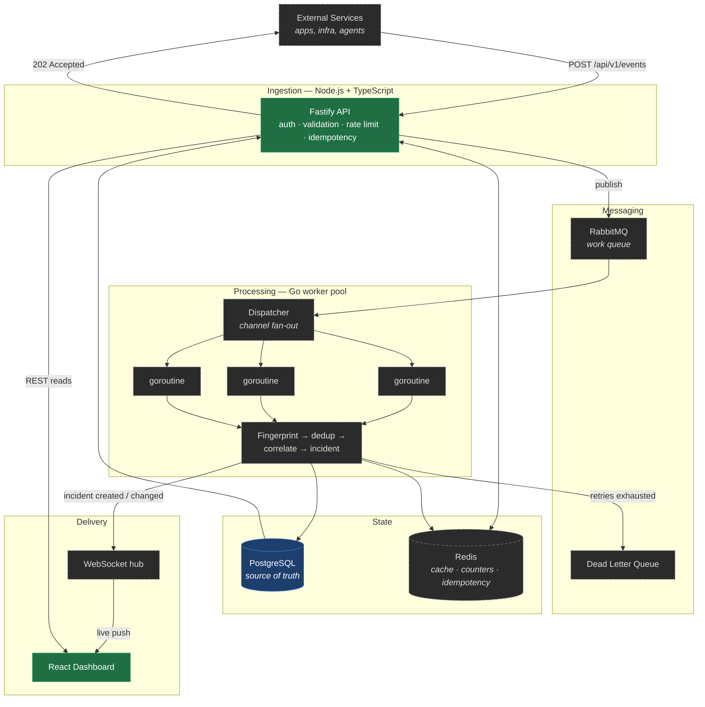
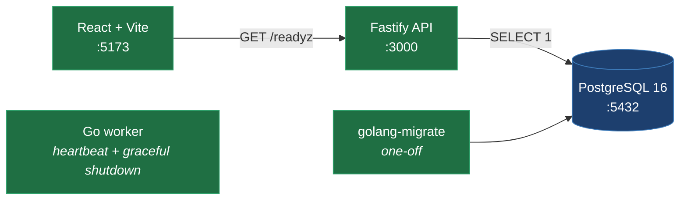

# SentinelOps

[](https://github.com/man-singh-dev/SentinelOps/actions/workflows/api.yml)
[](https://github.com/man-singh-dev/SentinelOps/actions/workflows/worker.yml)
[](https://github.com/man-singh-dev/SentinelOps/actions/workflows/web.yml)

A distributed, real-time incident intelligence platform for service reliability.

SentinelOps ingests high-volume events from applications and infrastructure, correlates
them into incidents rather than drowning engineers in duplicate alerts, and surfaces
service health on a live dashboard. Ten thousand identical payment-service failures
should produce **one incident with ten thousand attached events**, not ten thousand
pages at 3am.

> **Build status: Phase 0 of 9.** This repository currently contains the runnable
> skeleton — process wiring, health checks, config validation, graceful shutdown,
> migrations, and CI. **There is no event ingestion, queue, or incident logic yet.**
> The architecture below is the target; the [Roadmap](#roadmap) states exactly what
> is built and what is not. Nothing here is deployed or production-tested.

---

## Table of contents

- [Why this exists](#why-this-exists)
- [Target architecture](#target-architecture)
- [What runs today](#what-runs-today)
- [Design decisions](#design-decisions)
- [Getting started](#getting-started)
- [Project layout](#project-layout)
- [Development](#development)
- [Database](#database)
- [Roadmap](#roadmap)
- [Troubleshooting](#troubleshooting)

---

## Why this exists

Alerting systems fail in predictable ways. They create one incident per event, so a
single database outage becomes a wall of noise. They process events synchronously, so
an ingestion spike takes down the API that receives it. They retry naively, so a
transient failure becomes an infinite loop. They lose events when a worker restarts
mid-processing.

SentinelOps is built around those failure modes specifically: asynchronous processing
so ingestion stays cheap, deduplication so incidents map to root causes, idempotency
so retried deliveries are harmless, bounded retries with a dead-letter queue so
failures are visible rather than silent, and graceful shutdown so in-flight work
drains instead of vanishing.

---

## Target architecture

The complete system. **Solid boxes are implemented; dashed boxes are not built yet.**



### Request lifecycle (target)

Why an event returns `202` before it has been processed, and what happens after:

```mermaid
sequenceDiagram
    participant S as Service
    participant A as API
    participant R as Redis
    participant Q as RabbitMQ
    participant W as Go Worker
    participant P as PostgreSQL
    participant D as Dashboard

    S->>A: POST /api/v1/events (event_id: abc123)
    A->>R: rate limit check
    A->>A: validate schema + API key
    A->>R: SETNX idempotency:abc123
    alt already seen
        A-->>S: 202 (no-op, duplicate delivery)
    else first delivery
        A->>Q: publish
        A-->>S: 202 Accepted
    end

    Q->>W: deliver (prefetch-bounded)
    W->>W: compute fingerprint
    W->>P: BEGIN
    W->>P: find open incident matching fingerprint
    alt match within time window
        W->>P: attach event, bump last_seen
    else no match
        W->>P: create incident
    end
    W->>P: COMMIT
    W->>Q: ack

    Note over W,Q: nack + backoff on failure;<br/>to DLQ after N attempts

    W->>D: WebSocket push
```

The key property: **the API never blocks on processing.** An ingestion spike grows the
queue, not the API's latency. Workers scale independently of the ingestion tier, and
a worker crash loses nothing because messages are only acked after the transaction
commits.

---

## What runs today

Phase 0 in full. Everything below is implemented and reviewable in the commit history.



| Component | State |
|---|---|
| `apps/api` | Fastify + TypeScript. Env validated at boot, structured logging via pino, `/healthz` and `/readyz`. **No business routes.** |
| `apps/worker` | Go, zero external dependencies. Heartbeat every 5s, `signal.NotifyContext` shutdown with bounded drain. **No queue consumer.** |
| `apps/web` | React + Vite + TypeScript. One page rendering API readiness. **No dashboard.** |
| `db/migrations` | Plain SQL via `golang-migrate`. One migration: `services`. |
| `docker-compose.yml` | Postgres + three apps, dev only. No Redis, no RabbitMQ yet — by design. |
| `.github/workflows` | Path-filtered CI: lint, typecheck, build per app; `go vet` + `go test` for the worker. |

---

## Design decisions

Full reasoning lives in [`docs/adr/`](docs/adr/). The four that shape everything else:

**Migrations belong to neither service** ([ADR-0001](docs/adr/0001-plain-sql-migrations-owned-by-neither-service.md))
Both the Node API and the Go worker read and write the same database. If each carried
its own migration directory they would drift, and eventually a deploy would leave the
worker expecting a column the API had not created. One directory, applied by a
dedicated step before either service starts, removes the entire class of problem.

**Liveness and readiness are different questions** ([ADR-0002](docs/adr/0002-separate-liveness-and-readiness-endpoints.md))
`/healthz` asks "is this process alive" and touches nothing. `/readyz` asks "can I
serve traffic right now" and checks Postgres. Conflating them means a database blip
triggers a restart loop across the entire fleet — restarting the API does not fix
Postgres, it just adds a crash-loop to an already-degraded system.

**The worker starts with zero dependencies** ([ADR-0003](docs/adr/0003-go-worker-zero-dependencies-in-phase-0.md))
The shutdown skeleton — context threaded through every call, `sync.WaitGroup`, bounded
drain timeout — is what the whole worker pool hangs off. Built while it is trivially
verifiable, not retrofitted into a running pool later.

**Postgres only, queue deferred** ([ADR-0004](docs/adr/0004-postgres-only-infra-defer-queue.md))
Redis has no job until rate limiting. RabbitMQ has no job until ingestion exists.
Starting containers nothing talks to teaches nothing. Each arrives in the phase where
it solves a real problem, with its own ADR.

---

## Getting started

**Prerequisites:** Docker Desktop with Compose v2. Node 20+ and Go 1.22+ only if you
want to run services outside containers.

```bash
git clone https://github.com/man-singh-dev/SentinelOps.git
cd SentinelOps
cp .env.example .env
docker compose up --build
```

Apply migrations in a second terminal:

```bash
docker compose --profile tools run --rm migrate up
```

`migrate` uses a Compose profile because it is a one-off task, not a long-running
service — it should not restart with the stack or appear in `docker compose ps`.

Verify:

| Check | Expected |
|---|---|
| `curl localhost:3000/healthz` | `{"status":"ok"}` |
| `curl localhost:3000/readyz` | `{"status":"ok"}`, or `503` with Postgres stopped |
| http://localhost:5173 | Page showing API status |
| `docker compose logs worker` | Heartbeat every 5s |
| `docker compose stop worker` | Logs shutdown, exits cleanly — not SIGKILLed after 10s |

### Configuration

All config comes from environment variables and is **validated at startup**. A service
with a missing or malformed variable refuses to start rather than failing later on
first request. See [`.env.example`](.env.example) for the full surface.

| Variable | Used by | Purpose |
|---|---|---|
| `POSTGRES_USER` / `POSTGRES_PASSWORD` / `POSTGRES_DB` | postgres | Database bootstrap |
| `DATABASE_URL` | api, migrate | Connection string |
| `API_PORT` | api | Listen port |
| `NODE_ENV` | api | Pretty logs when not `production` |
| `LOG_LEVEL` / `WORKER_LOG_LEVEL` | api / worker | Log verbosity |
| `VITE_API_URL` | web | API base URL (`VITE_` prefix required to reach client code) |

Secrets are never committed. `.env` is gitignored; `.env.example` documents the shape
with development-only values.

---

## Project layout

```
SentinelOps/
├── apps/
│   ├── api/                 Node 20 · TypeScript · Fastify
│   │   └── src/
│   │       ├── config.ts    env parsing + validation, fails fast
│   │       ├── db.ts        pg Pool
│   │       ├── logger.ts    pino
│   │       ├── server.ts    route registration
│   │       └── index.ts     composition root
│   ├── worker/              Go 1.22
│   │   ├── cmd/worker/      main, signal handling, shutdown
│   │   └── internal/
│   │       ├── config/      env parsing
│   │       └── heartbeat/   placeholder unit of work
│   └── web/                 React · TypeScript · Vite
├── db/migrations/           plain SQL, golang-migrate
├── deploy/docker/           Dockerfiles (dev: hot reload, not production images)
├── docs/adr/                architecture decision records
├── .github/workflows/       path-filtered CI
└── docker-compose.yml
```

Monorepo, deliberately. The event contract crosses three languages — adding a field
touches the Node validator, the Go struct, and the React types together. One commit,
one CI run, no window where the API accepts a field the worker silently drops. The
cost is path-filtered CI and no per-service versioning, neither of which matters until
separate teams deploy on separate cadences.

---

## Development

Run a service natively against containerized Postgres:

```bash
docker compose up postgres -d

cd apps/api    && npm install && npm run dev
cd apps/worker && go run ./cmd/worker
cd apps/web    && npm install && npm run dev
```

Note that `DATABASE_URL` in `.env` uses the Compose hostname `postgres`. Running the
API on the host requires `localhost` instead.

Per-app commands:

```bash
# api / web
npm run lint && npm run typecheck && npm run build

# worker
go vet ./... && go build ./... && go test ./...
```

CI runs exactly these, filtered by path so a frontend change does not rebuild the Go
worker.

---

## Database

PostgreSQL is the source of truth. Redis, when it arrives, is a cache and never
authoritative.

```bash
docker compose --profile tools run --rm migrate up        # apply
docker compose --profile tools run --rm migrate down 1    # roll back one
docker compose --profile tools run --rm migrate version   # current version
```

Migrations are plain, forward-only SQL with explicit `.up.sql` / `.down.sql` pairs. No
ORM-generated schema: the schema is a design artifact worth reading and reviewing
directly, and generated migrations obscure exactly the details — index choice,
constraint naming, column ordering — that matter under load.

Current schema is `services` only. Tables arrive when a requirement needs them, not
speculatively.

---

## Roadmap

| Phase | Scope | State |
|---|---|---|
| **0** | Skeleton: structure, health, config, migrations, shutdown, CI | ✅ Complete |
| **1** | Event ingestion, domain model, REST API, Postgres persistence | ⬜ Not started |
| **2** | RabbitMQ, Go worker pool consuming real work | ⬜ Not started |
| **3** | Deduplication, idempotency, retries with backoff, DLQ, rate limiting | ⬜ Not started |
| **4** | Redis caching and distributed counters | ⬜ Not started |
| **5** | WebSockets, live dashboard updates | ⬜ Not started |
| **6** | Dashboard: overview, incident list/detail, service views | ⬜ Not started |
| **7** | Auth, RBAC, service API keys, audit logging | ⬜ Not started |
| **8** | Observability: throughput, queue depth, latency, worker utilization | ⬜ Not started |
| **9** | Production images, CI/CD, cloud deployment | ⬜ Not started |

Phase 1 writes to Postgres synchronously from the API; Phase 2 moves that write behind
the queue. This is a **planned refactor, not rework** — validation, schema, and tests
all survive, and only the final step of the handler changes from insert to publish.

---

## Troubleshooting

**`docker compose up` fails on missing variables** — `.env` does not exist. Run
`cp .env.example .env`. Compose interpolates from `.env` in the project root and
errors on unset variables rather than substituting empty strings.

**`/readyz` returns 503** — Postgres is not accepting connections. Check
`docker compose ps` and `docker compose logs postgres`. `/healthz` should still return
200; if it does not, the API process itself is down.

**Port already allocated** — something else holds 5432, 3000, or 5173. Change the host
side of the mapping in `docker-compose.yml`, or stop the conflicting process.

**Migrations fail with connection refused** — the `migrate` service waits for the
Postgres healthcheck, so this usually means `DATABASE_URL` points at `localhost`
instead of the Compose hostname `postgres`.

**Worker takes 10s to stop** — Docker sent SIGTERM, nothing handled it, and SIGKILL
followed. The graceful shutdown path is not being exercised; check that signals reach
the Go binary rather than being swallowed by the hot-reload wrapper.

---

## License

Not yet licensed. All rights reserved pending a decision.
