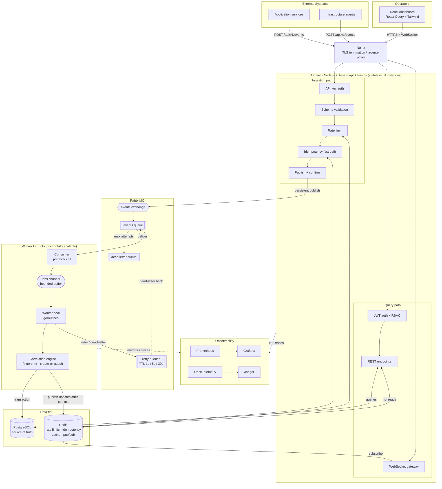
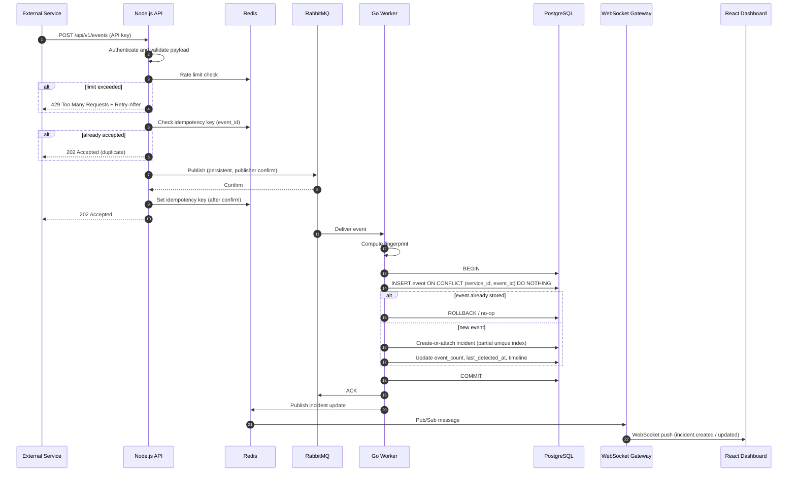
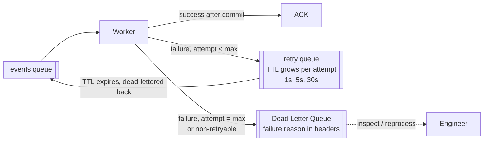
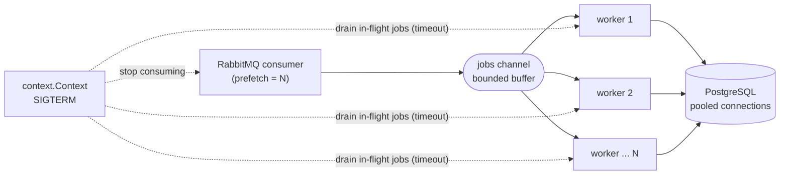
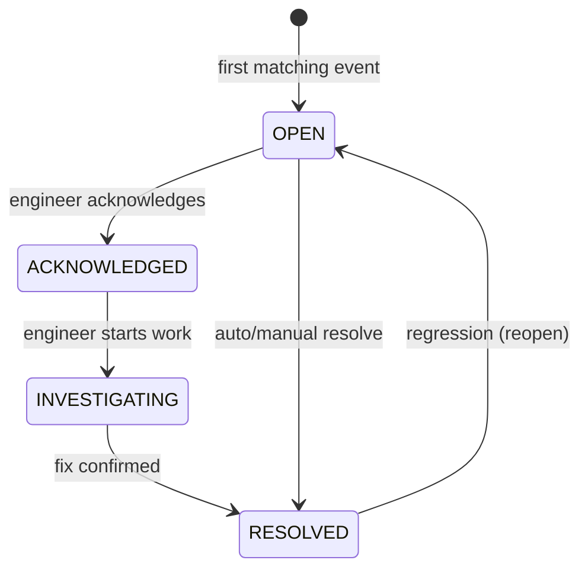
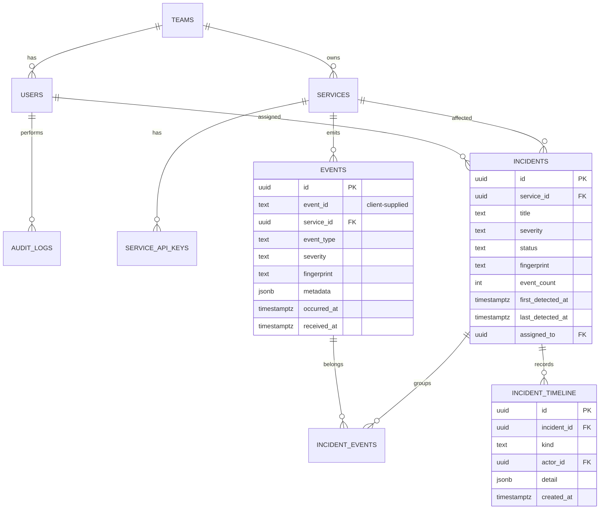

# SentinelOps

**Real-time incident intelligence and service reliability platform.**

SentinelOps ingests high-volume events from applications and infrastructure, deduplicates and correlates them into incidents, and gives engineering teams a live dashboard to investigate and resolve failures.

> **10,000 identical `payment-service` failures produce 1 incident with 10,000 related events, not 10,000 alerts.**


---

## Table of Contents

1. [Why SentinelOps](#why-sentinelops)
2. [Guarantees at a Glance](#guarantees-at-a-glance)
3. [Architecture](#architecture)
4. [Event Lifecycle](#event-lifecycle)
5. [Core Design](#core-design)
6. [Invariants and Verification](#invariants-and-verification)
7. [Tech Stack and Rationale](#tech-stack-and-rationale)
8. [Repository Structure](#repository-structure)
9. [Getting Started](#getting-started)
10. [API Overview](#api-overview)
11. [Data Model](#data-model)
12. [Security](#security)
13. [Observability](#observability)
14. [Failure Modes](#failure-modes)
15. [Performance Methodology](#performance-methodology)
16. [Design Decisions (ADRs)](#design-decisions-adrs)
17. [Roadmap](#roadmap)
18. [Engineering Principles](#engineering-principles)
19. [Contributing](#contributing)
20. [License](#license)

---

## Why SentinelOps

During an outage, monitoring systems can generate thousands of near-identical alerts. Engineers drown in noise instead of fixing the problem. SentinelOps addresses this by:

- **Decoupling ingestion from processing**: the API accepts events fast and hands heavy work to a durable queue.
- **Correlating events**: identical failures collapse into one incident using a fingerprint and a time window.
- **Being safe under retries**: duplicate deliveries are treated as one logical event.
- **Failing gracefully**: bounded retries with exponential backoff, then a Dead Letter Queue with the failure reason attached.
- **Updating live**: engineers see new incidents and state changes over WebSockets, with no refresh.

---

## Guarantees at a Glance

| Guarantee | How it is achieved |
|-----------|--------------------|
| No accepted event is lost | Persistent messages, publisher confirms, ACK only after the database commit |
| Effectively-once processing | At-least-once delivery combined with idempotent writes (`UNIQUE (service_id, event_id)`) |
| One active incident per fingerprint | Partial unique index plus `INSERT ... ON CONFLICT` |
| Bounded failure handling | Max retry attempts, exponential backoff, then DLQ |
| Correctness without Redis | PostgreSQL is the source of truth; Redis is an optimization |
| Safe shutdown | Workers drain in-flight jobs on `SIGTERM`; unacked messages are redelivered |

> SentinelOps does **not** claim exactly-once delivery. It provides at-least-once delivery with idempotent writes, which yields effectively-once processing.

These guarantees are checked by an automated invariant checker and a chaos suite (see [Invariants and Verification](#invariants-and-verification)).

---

## Architecture


```mermaid
flowchart TB
    subgraph EXT["External Systems"]
        direction LR
        S1["Application services"]
        S2["Infrastructure agents"]
    end

    subgraph USERS["Operators"]
        direction LR
        FE["React dashboard<br/>React Query + Tailwind"]
    end

    NG["Nginx<br/>TLS termination / reverse proxy"]

    subgraph API["API tier · Node.js + TypeScript + Fastify (stateless, N instances)"]
        direction TB
        subgraph ING["Ingestion path"]
            direction LR
            A1["API key auth"] --> A2["Schema validation"] --> A3["Rate limit"] --> A4["Idempotency fast path"] --> A5["Publish + confirm"]
        end
        subgraph SRV["Query path"]
            direction LR
            B1["JWT auth + RBAC"] --> B2["REST endpoints"]
            B3["WebSocket gateway"]
        end
    end

    subgraph BROKER["RabbitMQ"]
        direction LR
        EX{{"events exchange"}}
        QE[["events queue"]]
        QR[["retry queues<br/>TTL 1s / 5s / 30s"]]
        QD[["dead letter queue"]]
        EX --> QE
        QR -. "dead-letter back" .-> QE
        QE -. "max attempts" .-> QD
    end

    subgraph WRK["Worker tier · Go (horizontally scalable)"]
        direction TB
        W1["Consumer<br/>prefetch = N"] --> W2(["jobs channel<br/>bounded buffer"])
        W2 --> W3["Worker pool<br/>goroutines"]
        W3 --> W4["Correlation engine<br/>fingerprint · create-or-attach"]
    end

    subgraph DATA["Data tier"]
        direction LR
        PG[("PostgreSQL<br/>source of truth")]
        RD[("Redis<br/>rate limits · idempotency<br/>cache · pub/sub")]
    end

    subgraph OBS["Observability"]
        direction LR
        PR["Prometheus"] --> GR["Grafana"]
        OT["OpenTelemetry"] --> JG["Jaeger"]
    end

    S1 -->|"POST /api/v1/events"| NG
    S2 -->|"POST /api/v1/events"| NG
    FE -->|"HTTPS + WebSocket"| NG
    NG --> A1
    NG --> B1
    NG --> B3

    A3 <--> RD
    A4 <--> RD
    A5 -->|"persistent publish"| EX
    QE -->|"deliver"| W1
    W3 -->|"retry / dead-letter"| QR
    W4 -->|"transaction"| PG
    W4 -->|"publish updates after commit"| RD
    RD -->|"subscribe"| B3
    B2 <-->|"queries"| PG
    B2 <-->|"hot reads"| RD

    API -. "metrics + traces" .-> OBS
    WRK -. "metrics + traces" .-> OBS
```

### Component responsibilities

| Component | Responsibility | Deliberately does NOT do |
|-----------|----------------|--------------------------|
| **Node.js API** | Authenticate, validate, rate limit, enqueue events; serve dashboard REST APIs; push real-time updates | Heavy event processing |
| **RabbitMQ** | Durable buffer between ingestion and processing; retry and dead-letter routing | Business logic |
| **Go workers** | Concurrent processing, fingerprinting, deduplication, incident create/attach | Serve user-facing HTTP |
| **PostgreSQL** | Source of truth for events, incidents, users, audit logs | Low-latency counters |
| **Redis** | Rate limiting, short-lived idempotency keys, hot caches, pub/sub fan-out | Durable storage |
| **React dashboard** | Overview, incident list/detail, service health, live updates | Business logic |

---

## Event Lifecycle


```mermaid
sequenceDiagram
    autonumber
    participant Svc as External Service
    participant API as Node.js API
    participant R as Redis
    participant MQ as RabbitMQ
    participant W as Go Worker
    participant PG as PostgreSQL
    participant WS as WebSocket Gateway
    participant UI as React Dashboard

    Svc->>API: POST /api/v1/events (API key)
    API->>API: Authenticate and validate payload
    API->>R: Rate limit check
    alt limit exceeded
        API-->>Svc: 429 Too Many Requests + Retry-After
    end
    API->>R: Check idempotency key (event_id)
    alt already accepted
        API-->>Svc: 202 Accepted (duplicate)
    end
    API->>MQ: Publish (persistent, publisher confirm)
    MQ-->>API: Confirm
    API->>R: Set idempotency key (after confirm)
    API-->>Svc: 202 Accepted

    MQ->>W: Deliver event
    W->>W: Compute fingerprint
    W->>PG: BEGIN
    W->>PG: INSERT event ON CONFLICT (service_id, event_id) DO NOTHING
    alt event already stored
        W->>PG: ROLLBACK / no-op
    else new event
        W->>PG: Create-or-attach incident (partial unique index)
        W->>PG: Update event_count, last_detected_at, timeline
    end
    W->>PG: COMMIT
    W->>MQ: ACK
    W->>R: Publish incident update
    R->>WS: Pub/Sub message
    WS->>UI: WebSocket push (incident.created / updated)
```

**Key points**

- The API returns `202 Accepted` once the event is durably queued, so ingestion latency is independent of database load.
- The idempotency key is set **after** the publish is confirmed. Setting it earlier would let a crash between the two steps silently drop an event on retry.
- The worker ACKs only **after** the transaction commits. A crash between commit and ACK causes a redelivery, which the unique constraint turns into a no-op.

---

## Core Design

### 1. Deduplication and correlation

Each event is reduced to a **fingerprint**:

```
fingerprint = hash(service + event_type + normalized_error_signature)
```

The worker looks up an **active incident** (not `RESOLVED`) with the same fingerprint. If one exists within the correlation window, the event is attached; otherwise a new incident is created.

- **Window semantics:** the window is **sliding**, measured from the incident's `last_detected_at`. A continuous failure stays one incident; a failure that stops for longer than `DEDUP_WINDOW_SECONDS` starts a new one.
- **Late events after resolve:** an event matching a resolved incident does not silently attach to it. It creates a new incident (or triggers a reopen, per the rule recorded in the ADR) so that resolved history is never rewritten.
- **Ordering:** incident time boundaries are driven by `occurred_at`, while `received_at` is kept for diagnostics. Out-of-order events are handled with `LEAST/GREATEST` updates rather than blind overwrites.
- **Severity escalation:** a higher-severity event raises the incident severity and records a `severity_changed` timeline entry.
- **Race safety:** two workers processing the same fingerprint concurrently are serialized by a partial unique index on `(fingerprint) WHERE status <> 'RESOLVED'` combined with `INSERT ... ON CONFLICT`.
- **Normalization:** volatile values (UUIDs, numeric IDs, timestamps, hex addresses) are stripped from error messages so equivalent failures share a signature. Normalization is covered by table-driven tests that include adversarial cases.

### 2. Idempotency (two layers)

| Layer | Mechanism | Purpose |
|-------|-----------|---------|
| Fast path | Redis `SET NX` with TTL on `(service, event_id)` | Reject obvious duplicates before they reach the queue |
| Source of truth | PostgreSQL `UNIQUE (service_id, event_id)` | Correctness even if Redis is empty, evicted, or down |

Redis is an optimization; PostgreSQL is the guarantee. If `abc123` arrives three times, exactly one logical event is stored.

### 3. Retries, exponential backoff and Dead Letter Queue


```mermaid
flowchart LR
    Q[["events queue"]] --> W["Worker"]
    W -->|"success after commit"| ACK["ACK"]
    W -->|"failure, attempt < max"| R1[["retry queue<br/>TTL grows per attempt<br/>1s, 5s, 30s"]]
    R1 -->|"TTL expires, dead-lettered back"| Q
    W -->|"failure, attempt = max<br/>or non-retryable"| DLQ[["Dead Letter Queue<br/>failure reason in headers"]]
    DLQ -.->|"inspect / reprocess"| OPS["Engineer"]
```

- Attempt count is tracked in message headers.
- Retries are bounded, so there are no infinite loops.
- Non-retryable errors (for example malformed payloads) skip retries and go straight to the DLQ.
- DLQ entries carry the failure reason and can be inspected and replayed from the API.

### 4. Go worker pool


```mermaid
flowchart LR
    C["RabbitMQ consumer<br/>(prefetch = N)"] --> J(["jobs channel<br/>bounded buffer"])
    J --> G1["worker 1"]
    J --> G2["worker 2"]
    J --> G3["worker ... N"]
    G1 & G2 & G3 --> DB[("PostgreSQL<br/>pooled connections")]
    CTX["context.Context<br/>SIGTERM"] -.->|"stop consuming"| C
    CTX -.->|"drain in-flight jobs (timeout)"| G1 & G2 & G3
```

- A fixed number of goroutines pull from a bounded channel; the buffer size and RabbitMQ prefetch provide **backpressure**.
- **Graceful shutdown:** on `SIGTERM` the consumer stops accepting messages, in-flight jobs finish within a timeout, and unacked messages are redelivered.
- Every database call uses a `context` with a timeout.

### 5. Hot-incident contention

During a large burst, every event for one fingerprint updates the same incident row, which serializes workers on a row lock. SentinelOps treats this as a measured problem rather than an assumption: the worker batches events per fingerprint and applies one incident update per batch. The before and after measurements live in `docs/benchmarks.md`.

### 6. Incident lifecycle


```mermaid
stateDiagram-v2
    [*] --> OPEN: first matching event
    OPEN --> ACKNOWLEDGED: engineer acknowledges
    ACKNOWLEDGED --> INVESTIGATING: engineer starts work
    INVESTIGATING --> RESOLVED: fix confirmed
    OPEN --> RESOLVED: auto/manual resolve
    RESOLVED --> OPEN: regression (reopen)
```

Transitions are enforced by a state machine with unit tests for every valid and invalid move. Every transition writes an `incident_timeline` row and an `audit_logs` entry.

### 7. Rate limiting

Per-API-key and per-IP counters in Redis using a sliding-window algorithm. Exceeding a limit returns `429` with a `Retry-After` header. If Redis is unavailable, the API follows an explicit fallback policy (documented in `docs/failure-modes.md`) rather than failing silently.

### 8. Redis usage (deliberately narrow)

| Use case | Why Redis |
|----------|-----------|
| Rate limit counters | Atomic, fast, shared across API instances |
| Idempotency keys (TTL) | Short-lived, cheap dedup fast path |
| Dashboard stats and service health cache | Read-heavy, tolerant of seconds of staleness |
| Pub/Sub for real-time updates | Lets multiple API instances broadcast to their own WebSocket clients |

PostgreSQL remains the source of truth for everything.

---

## Invariants and Verification

Correctness claims are written down as invariants and checked automatically.

| # | Invariant |
|---|-----------|
| 1 | Every event the API accepted (`202`) is either stored or present in the DLQ with a reason |
| 2 | At most one stored event exists per `(service_id, event_id)` |
| 3 | At most one non-resolved incident exists per fingerprint |
| 4 | `incidents.event_count` equals the number of linked `incident_events` rows |
| 5 | Every incident state transition has a matching `incident_timeline` row |

`scripts/check-invariants` queries the database and fails loudly if any invariant is violated. It runs after every integration test and every chaos scenario.

### Chaos suite

| Scenario | Expected result |
|----------|-----------------|
| `kill -9` a worker mid-burst | Messages redelivered; no loss, no duplicates |
| Stop PostgreSQL for 30 seconds | Retries with backoff, then recovery or DLQ; nothing lost |
| Restart RabbitMQ | Publisher confirms behave; no silent drops |
| Flush Redis mid-test | PostgreSQL still deduplicates |
| Send each event 3 times, concurrently | One stored event |
| Poison message | Lands in the DLQ with a reason; the pipeline keeps moving |

Scripts and recorded output live in `tests/chaos/` and `docs/chaos-results.md`.

---

## Tech Stack and Rationale

| Layer | Choice | Why |
|-------|--------|-----|
| Frontend | React, TypeScript, Tailwind, React Query | Typed UI; React Query handles caching, refetching and WebSocket-driven invalidation |
| API | Node.js, TypeScript, Fastify | Strong I/O concurrency, schema-based validation, low overhead |
| Workers | Go | Goroutines and channels suit concurrent processing and graceful shutdown |
| Queue | RabbitMQ | Per-message ACK, TTL and dead-letter exchanges map directly to retries and DLQ |
| Database | PostgreSQL | Transactions, constraints, partial unique indexes, relational integrity |
| Cache | Redis | Atomic counters, TTL keys, pub/sub |
| Observability | Prometheus, Grafana, OpenTelemetry, Jaeger | Metrics, dashboards and distributed traces |
| Infra | Docker, Docker Compose, Nginx, GitHub Actions | Reproducible local environment, reverse proxy, CI/CD |
| Cloud | AWS (Terraform) | Optional deployment target |

**Why not Kafka?** Kafka excels at replayable, high-throughput event streams. SentinelOps needs per-message acknowledgement, delayed retries and DLQ routing, which RabbitMQ provides natively with less operational weight. The decision should be revisited if event replay or very high throughput become requirements. See ADR-001.

---

## Repository Structure

```
SentinelOps/
├── apps/
│   ├── api/                 # Node.js + TypeScript API (REST + WebSocket)
│   │   ├── src/
│   │   │   ├── modules/     # events, incidents, services, auth, users
│   │   │   ├── plugins/     # db, redis, queue, auth, rate-limit
│   │   │   └── ws/          # WebSocket gateway
│   │   └── tests/
│   ├── worker/              # Go worker service
│   │   ├── cmd/worker/      # entrypoint
│   │   └── internal/        # consumer, pool, correlation engine, store
│   └── web/                 # React + TypeScript dashboard
│       └── src/
├── db/
│   └── migrations/          # versioned SQL migrations
├── infra/
│   ├── docker/
│   ├── nginx/
│   ├── observability/       # Prometheus, Grafana dashboards, OTel config
│   └── terraform/           # AWS infrastructure
├── scripts/
│   ├── check-invariants/    # database invariant checker
│   └── load/                # load and benchmark scripts
├── tests/
│   └── chaos/               # chaos scenarios
├── docs/
│   ├── architecture.md
│   ├── failure-modes.md
│   ├── benchmarks.md
│   ├── chaos-results.md
│   ├── devlog.md
│   └── adr/                 # architecture decision records
├── .github/workflows/       # CI
├── docker-compose.yml
├── .env.example
├── Makefile
└── README.md
```

---

## Getting Started

### Prerequisites

- Docker and Docker Compose
- Node.js 20+ and npm/pnpm (for local API and web development)
- Go 1.22+ (for local worker development)

### Run locally

```bash
git clone https://github.com/man-singh-dev/SentinelOps.git
cd SentinelOps

cp .env.example .env        # fill in values; never commit secrets
docker compose up --build
```

| Service | URL |
|---------|-----|
| Dashboard | http://localhost:5173 |
| API | http://localhost:3000 |
| RabbitMQ management | http://localhost:15672 |
| Grafana | http://localhost:3001 |

### One-command demo

```bash
make demo
```

Boots the stack, registers a service, sends 10,000 identical `payment-service` failures, waits for the queue to drain, and prints the resulting incident count and `event_count`.

### Send a test event

```bash
curl -X POST http://localhost:3000/api/v1/events \
  -H "Content-Type: application/json" \
  -H "X-API-Key: $SERVICE_API_KEY" \
  -d '{
    "event_id": "evt_abc123",
    "service": "payment-service",
    "event_type": "payment.failed",
    "severity": "critical",
    "message": "Gateway timeout while charging card",
    "timestamp": "2026-01-01T12:00:00Z",
    "metadata": { "region": "ap-south-1", "gateway": "stripe" }
  }'
```

Expected: `202 Accepted`. Sending the same `event_id` again does not create a second event.

### Configuration

All configuration is via environment variables (see `.env.example`). No secrets are hardcoded.

| Variable | Purpose |
|----------|---------|
| `DATABASE_URL` | PostgreSQL connection string |
| `REDIS_URL` | Redis connection string |
| `AMQP_URL` | RabbitMQ connection string |
| `JWT_SECRET` | User token signing |
| `WORKER_CONCURRENCY` | Number of worker goroutines |
| `WORKER_PREFETCH` | RabbitMQ prefetch count |
| `DEDUP_WINDOW_SECONDS` | Correlation window for incidents |
| `MAX_RETRY_ATTEMPTS` | Attempts before DLQ |
| `RATE_LIMIT_PER_MINUTE` | Default per-key limit |

---

## API Overview

Base path: `/api/v1`. The contract is published as OpenAPI.

| Method | Endpoint | Auth | Description |
|--------|----------|------|-------------|
| `POST` | `/events` | Service API key | Ingest an event (returns `202`) |
| `GET` | `/incidents` | Viewer+ | List with filter, sort, keyset pagination |
| `GET` | `/incidents/:id` | Viewer+ | Details, related events, timeline |
| `PATCH` | `/incidents/:id/status` | Engineer+ | Acknowledge / investigate / resolve / reopen |
| `POST` | `/incidents/:id/notes` | Engineer+ | Add a note |
| `GET` | `/services` | Viewer+ | Service list with health |
| `GET` | `/services/:id` | Viewer+ | Metrics, incidents, recent events |
| `POST` | `/services` | Admin | Register a service and issue an API key |
| `POST` | `/services/:id/keys/rotate` | Admin | Rotate or revoke a service API key |
| `GET` | `/stats/overview` | Viewer+ | Dashboard aggregates (cached) |
| `GET` | `/dlq` | Admin | Inspect dead-lettered events |
| `POST` | `/dlq/:id/reprocess` | Admin | Replay a dead-lettered event |
| `GET` | `/health`, `/ready`, `/metrics` | Internal | Liveness, readiness, Prometheus metrics |

**Real-time (WebSocket) events:** `incident.created`, `incident.severity_changed`, `incident.acknowledged`, `incident.resolved`, `service.health_changed`.

**Standard responses:** `202` accepted, `400` validation error, `401/403` auth errors, `409` conflict, `429` rate limited, `5xx` server errors, all using a consistent structured error body.

---

## Data Model


```mermaid
erDiagram
    USERS ||--o{ AUDIT_LOGS : performs
    TEAMS ||--o{ USERS : has
    TEAMS ||--o{ SERVICES : owns
    SERVICES ||--o{ SERVICE_API_KEYS : has
    SERVICES ||--o{ EVENTS : emits
    SERVICES ||--o{ INCIDENTS : affected
    INCIDENTS ||--o{ INCIDENT_EVENTS : groups
    EVENTS ||--o{ INCIDENT_EVENTS : belongs
    INCIDENTS ||--o{ INCIDENT_TIMELINE : records
    USERS ||--o{ INCIDENTS : assigned

    EVENTS {
        uuid id PK
        text event_id "client-supplied"
        uuid service_id FK
        text event_type
        text severity
        text fingerprint
        jsonb metadata
        timestamptz occurred_at
        timestamptz received_at
    }
    INCIDENTS {
        uuid id PK
        uuid service_id FK
        text title
        text severity
        text status
        text fingerprint
        int event_count
        timestamptz first_detected_at
        timestamptz last_detected_at
        uuid assigned_to FK
    }
    INCIDENT_TIMELINE {
        uuid id PK
        uuid incident_id FK
        text kind
        uuid actor_id FK
        jsonb detail
        timestamptz created_at
    }
```

**Important constraints and indexes**

- `UNIQUE (service_id, event_id)` on `events`: the idempotency guarantee.
- Partial unique index on `incidents (fingerprint) WHERE status <> 'RESOLVED'`: prevents duplicate active incidents.
- Index on `incidents (status, severity, last_detected_at DESC)` for list queries, verified with `EXPLAIN ANALYZE`.
- `CHECK` constraints on severity and status enums.
- Keyset (cursor) pagination for large lists.
- Time-based partitioning of `events` is evaluated as an experiment. Partition keys constrain unique indexes, so preserving `(service_id, event_id)` uniqueness is a recorded design decision.

---

## Security

| Concern | Approach |
|---------|----------|
| User authentication | argon2 password hashing and short-lived JWT access tokens with refresh |
| Service authentication | Per-service API keys; only hashes stored; revocable and rotatable |
| Authorization | RBAC: **Admin** (users, services, settings), **Engineer** (investigate, acknowledge, resolve, notes), **Viewer** (read-only) |
| Input validation | Schema validation on every external input |
| Abuse protection | Redis-backed rate limiting, payload size limits |
| Audit logging | Actor, action, target and timestamp for security-relevant actions, e.g. `USER_A ACKNOWLEDGED INCIDENT INC-1024` |
| Secrets | Environment variables only; `.env` is gitignored |
| Transport | TLS terminated at Nginx |

Authorization is covered by a role × endpoint test matrix.

---

## Observability

- **Metrics (Prometheus):** events processed per second, queue depth, worker utilization, processing latency, retry count, failed events, API latency, DB pool health
- **Tracing (OpenTelemetry + Jaeger):** a single request is traceable across API, RabbitMQ, worker and PostgreSQL
- **Logs:** structured JSON with request and correlation IDs carried through message headers into worker logs
- **Health:** `/health` (liveness) and `/ready` (PostgreSQL, Redis and RabbitMQ checks)
- **Dashboards:** a Grafana dashboard is committed under `infra/observability/`

---

## Failure Modes

The full table, including what is lost and how each failure is detected, lives in `docs/failure-modes.md`.

| Scenario | Behavior |
|----------|----------|
| Traffic spike | API keeps accepting; the queue absorbs the burst; workers drain at their own pace |
| Slow workers | Queue depth grows (visible in metrics); scale worker replicas horizontally |
| Worker crash mid-job | Message is unacked and redelivered; idempotency prevents double effects |
| Crash after commit, before ACK | Message is redelivered; the unique constraint makes the retry a no-op |
| Duplicate delivery | Redis fast path plus PostgreSQL unique constraint |
| Redis unavailable | Rate limiting follows the documented fallback policy; idempotency still enforced by PostgreSQL |
| PostgreSQL slow or down | Workers retry with backoff, then DLQ; the API still enqueues |
| Poison message | Bounded retries or immediate DLQ for non-retryable errors |
| Multiple API instances | Redis pub/sub fans real-time updates out to every WebSocket node |

**Known trade-offs**

- At-least-once delivery means correctness depends on idempotent writes.
- Eventual consistency between ingestion and dashboard (typically sub-second, not guaranteed).
- Redis pub/sub is fire-and-forget; the dashboard refetches on reconnect.
- Per-service ordering is not guaranteed across concurrent workers. The correlation engine is built to tolerate out-of-order events instead.

---

## Performance Methodology

Performance numbers are published only with their method. `docs/benchmarks.md` records:

- Hardware, software versions and exact commands
- Ingest rate, p50/p95/p99 latency, drain rate, and queue depth over time
- The identified bottleneck (using `pg_stat_statements`, `EXPLAIN ANALYZE` and profiling)
- A before/after comparison for each optimization, including the hot-incident batching change
- What was not tested

Scale experiments (partitioning, read replica) are reported with measured results, including cases where a change did not help.

---

## Design Decisions (ADRs)

Architecture decisions live in [`docs/adr`](docs/adr), each with the alternatives considered.

| ADR | Decision |
|-----|----------|
| 001 | RabbitMQ over Kafka |
| 002 | Postgres as the idempotency guarantee, Redis as an optimization |
| 003 | Publish/commit gap: set the idempotency key after a confirmed publish, versus a transactional outbox |
| 004 | Sliding correlation window and late-event semantics |
| 005 | `occurred_at` versus `received_at` for ordering |
| 006 | Per-fingerprint batching to relieve hot-row contention |
| 007 | Unique-key strategy under table partitioning |
| 008 | Redis-down fallback policy for rate limiting |

---

## Roadmap

Development proceeds in gated stages: a stage is finished only when its proof exists.

| Stage | Scope | Gate |
|-------|-------|------|
| 1 | Foundation: config, logging, Docker Compose, migrations, CI with integration tests | Fresh clone runs with `docker compose up`; CI green |
| 2 | Synchronous ingestion: services, API keys, events, constraints | Same `event_id` sent concurrently stores one row |
| 3 | Pipeline: RabbitMQ topology, publisher confirms, Go worker pool | `kill -9` on a worker loses nothing |
| 4 | Correlation engine: fingerprinting, incidents, race-safe create-or-attach | Boundary and concurrency tests pass; semantics recorded in ADRs |
| 5 | Reliability: idempotency, retries, DLQ, invariant checker, chaos suite | Chaos suite passes with a clean invariant check |
| 6 | Performance: benchmark, bottleneck analysis, hot-row fix | Reproducible before/after results |
| 7 | Product surface: incident APIs, rate limiting, WebSockets, auth, RBAC, dashboard | Authorization matrix passes; live updates work across two API instances |
| 8 | Observability: metrics, readiness, tracing, dashboards | One request traceable end to end |
| 9 | Scale experiments: partitioning, read replica | Measured results documented |
| 10 | Deployment: Dockerfiles, Nginx TLS, Terraform, CI/CD | Demo reproduced on AWS |
| 11 | Polish: `make demo`, failure-modes doc, ADRs, release | A stranger can run the demo in minutes |

---

## Engineering Principles

- Every technology solves a real problem; nothing is added for résumé value.
- Simple, maintainable code over unnecessary abstraction.
- Validate all external input; never hardcode secrets.
- Test the important logic: fingerprinting, dedup, lifecycle transitions, retry policy.
- Verify correctness claims with an invariant checker and chaos tests, not with assertions in prose.
- Publish benchmark methods alongside results, and report negative results honestly.
- Structured errors and structured logging throughout.
- Small, meaningful commits.

---

## Contributing

1. Fork the repo and create a feature branch (`feat/<short-description>`).
2. Keep changes focused; add or update tests.
3. Use [Conventional Commits](https://www.conventionalcommits.org/) (`feat:`, `fix:`, `docs:`).
4. Open a pull request describing what changed and why.

---

## License

To be decided. Add a `LICENSE` file (e.g. MIT) before accepting external contributions.

---

🚧 **Work in progress.**
